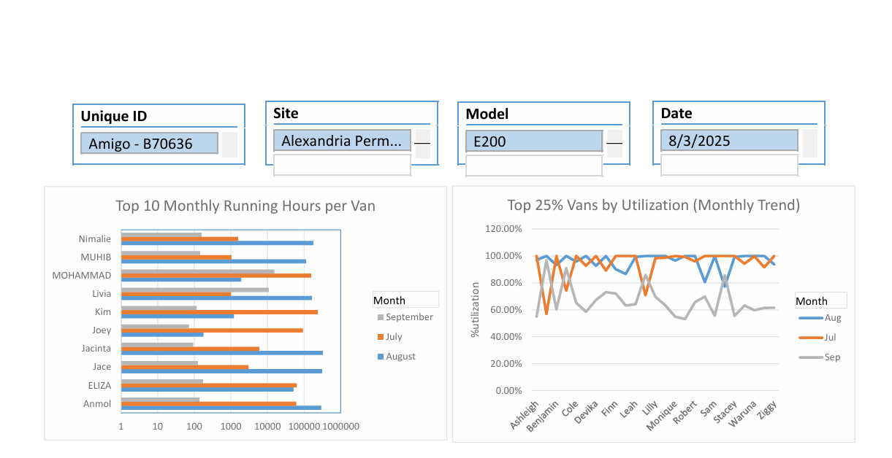

# Excel Dashboard: Vehicle Utilization Analysis

This is my first Excel dashboard project, created for a **Freelancer.com competition**.  
The objective was to design and build a **dynamic Excel dashboard** to track and visualize vehicle utilization across multiple sites.

---

## 📝 Project Objectives
- Track vehicle utilization using **engine hours**
- Identify **underused**, **optimal**, and **overused** vans
- Provide breakdown by **Site** (Alexandria, Dandenong, Truganina, Wetherill Park)
- Compare utilization by **Van Type** (V400 vs E200)
- Include slicers for filtering by **Site**, **Date**, and **Van Type**
- Allow daily refresh with new data without breaking structure

---

## 📊 Dashboard Insights
The dashboard shows:
- **Utilization categories**: Optimal, Overused, Underused  
- **Top 10 vans by monthly running hours**
- **Top 25% vs Bottom 25% vans utilization trends**
- **Breakdown by site and van type**
- **Interactive filters** to explore data easily

---

## 📂 Files
- `dashboard.pdf` → Final exported dashboard
- `dashboard.png` → Screenshot preview
- `vehicle_data.xlsx` → Dummy dataset (optional)

---

## 📷 Preview

👉 For the full version, see [dashboard.pdf](dashboard.pdf)

---

## ⚙️ Tools Used
- **Microsoft Excel**: PivotTables, Conditional Formatting, Charts, Slicers

---

## 🙋 About this Project
This was my **first dashboard project**, and it was built as part of a Freelancer.com challenge.  
I focused on:
- Clean and professional design (red, white, and black theme)
- Clear and smart visualization of utilization trends
- Making the dashboard easy to update daily
